## ボットを使用するには

- [LINE Developers](https://developers.line.biz/ja/) にアクセスする


- `LINEアカウントでログイン`を選択し、ログインする

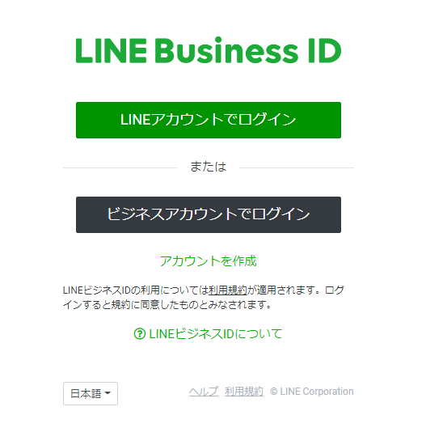

- `プロバイダー作成` を選択し、新規プロバイダーを作成する（既にある場合は別）

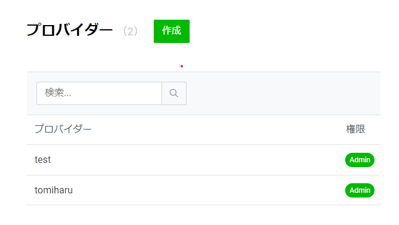

- プロバイダー名を入力して作成

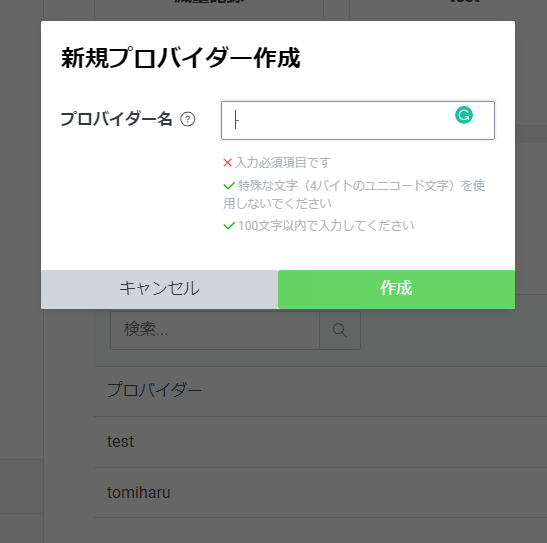

- `新規チャネル作成` をクリックする

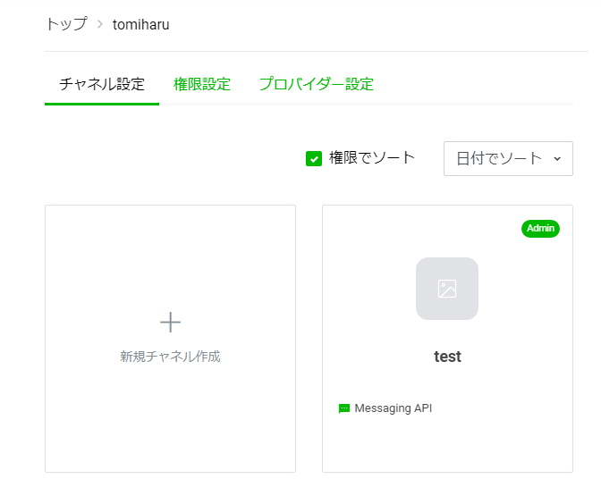

- `Messaging API` を選択する

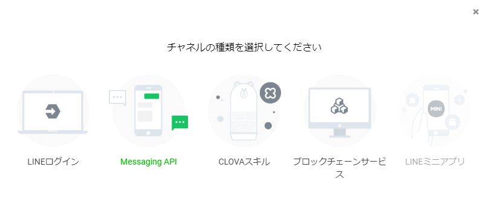

- チャネル名、説明、を入力し、大業種、小業種を適当に選択する

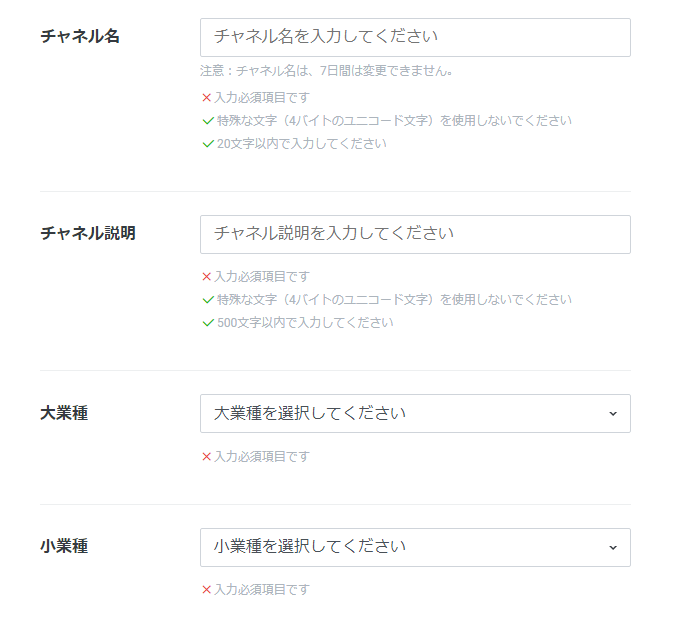

私は今回このようにしました

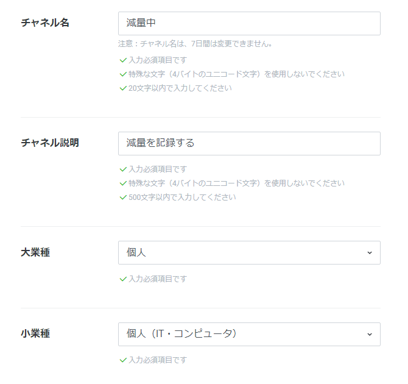

- 任意の欄は入力せず、利用規約に同意して作成する

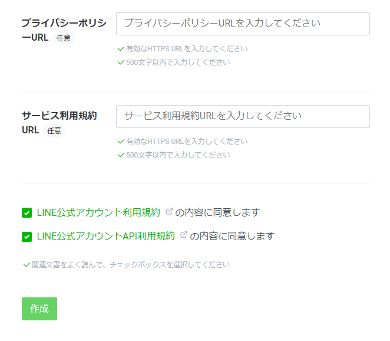

- トップ画面から、`Messaging API設定` へ

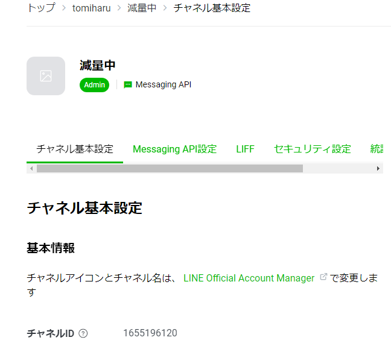

- LINE公式アカウント機能を以下のようにしたいので、右の `編集` をクリック

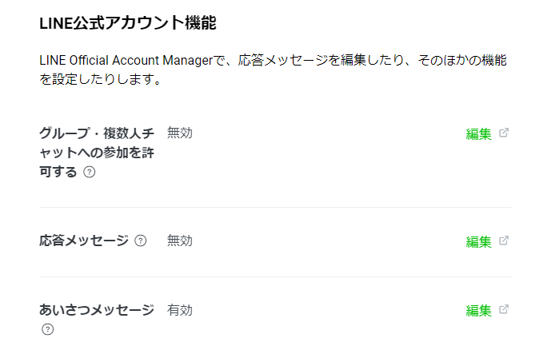

すると `LINE Official Account Manager` に飛ぶので、応答設定から、以下のようにする

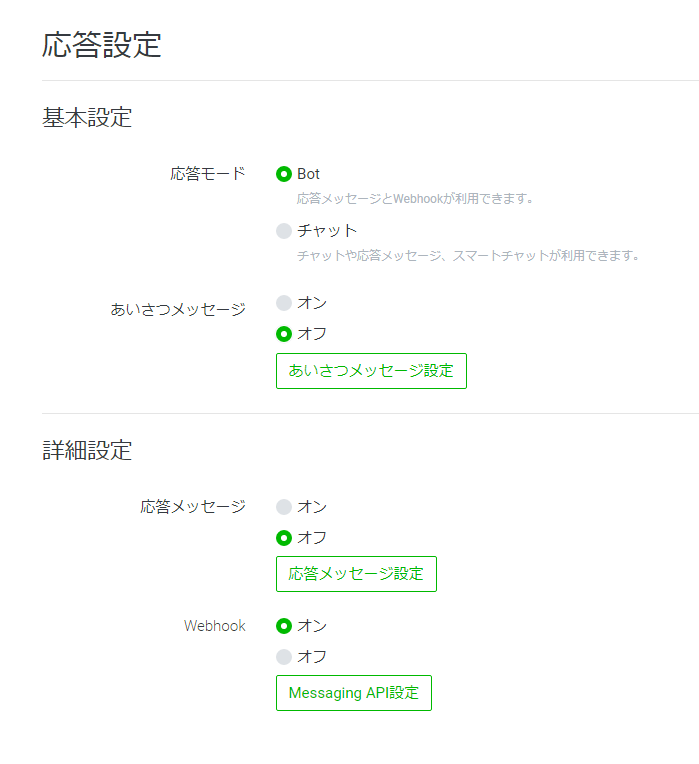

- `LINE Developers` に戻って、一番下にある `チャネルアクセストークン` を発行する（写真は再発行時）

ここまできたら、`LINE Developers` での作業は一旦終了

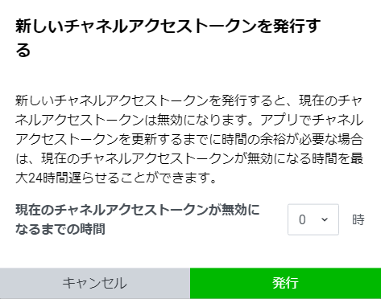

- 続いて、`Google Drive` から `Google Spread Sheet` を作成する

新規をクリックし、下のように選択すれば、シートが開く

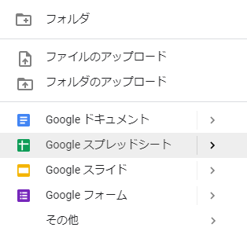

- シートを追加し、一枚を`shokuzai`、もう一枚を`nov2020`とする（11月の為）

Excelのテンプレートファイルがあるので、ダウンロードして全範囲をコピーし、全範囲に貼り付ければ、
シートが指定の様式になる

シートが下の写真のようになれば、ここでの作業は一旦終了

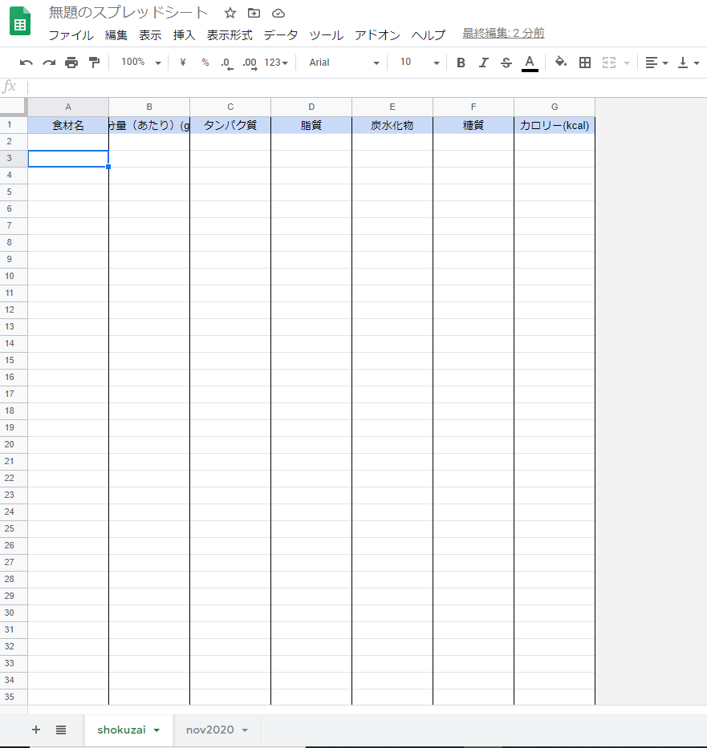

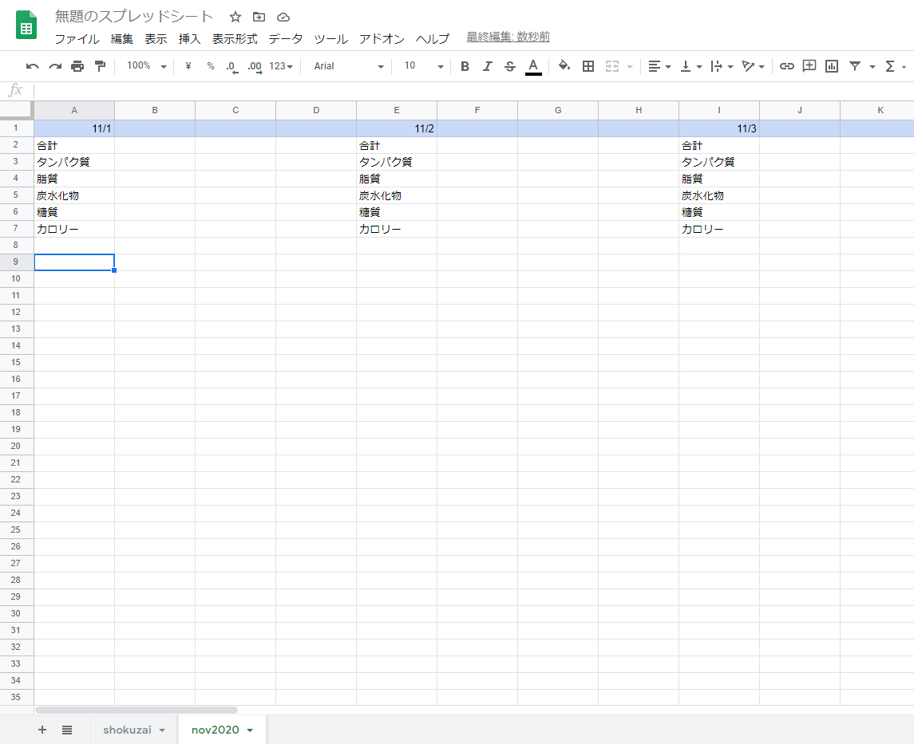

- 続いて、`Google Drive` から `新規=>その他=>Google Apps Script` と選択して、

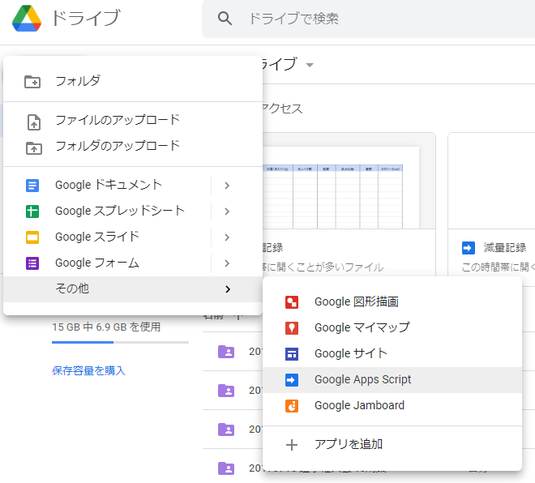

このように無題のプロジェクトが作成されていれば成功

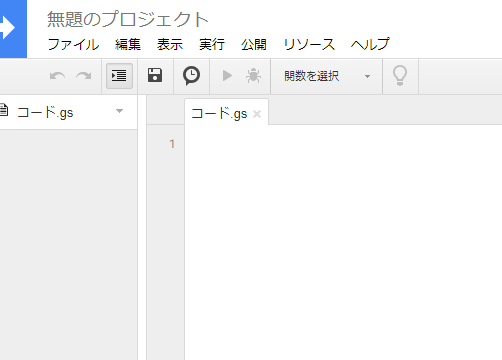

- ここに`main.js`のコードをコピーペーストする

```
const ACCESS_TOKEN = 'ここにアクセストークン';

const SHEET_ID = 'ここにスプレッドシートのID';
```

- `'ここにアクセストークン'` のところに、先ほど `LINE Developers` で作成した
`チャネルアクセストークン` をコピペする

- `スプレッドシートのID` は、`Google Spread Sheet` を開いたときに表示されている
URLの、`/d/`と`/edit...`に挟まれた部分のこと


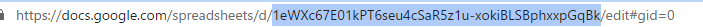

- これをコピペする

両方とも出来ている場合、
```
const ACCESS_TOKEN = 'xxxxxxxxx';

const SHEET_ID = 'xxxxxxxxxx';
```
のようになっている

すぐ下に、

```
const shokuzaiSheet = sheet.getSheetByName('shokuzai');
const recordSheet = sheet.getSheetByName("nov2020");
```

というコードがあるが、ここに記載されている`('shokuzai')`と`('nov2020')`が
 `Google Spread Sheet`のシート名に対応している

そのため、任意の名前にすることも可能

`Google Apps Script`を `Ctrl + S` で保存したら、以下のように、
`公開 => ウェブアプリケーションとして導入`を選択し、

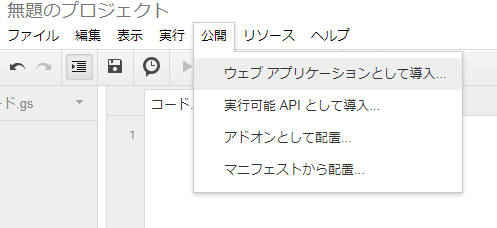

- **Project versionをNewにして**、
- **Who has access to the app** を **Anyone, even anonymous** にして、

更新する

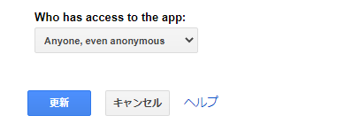

更新が成功すると、`Current web app URL` がでるので、これをコピーし、

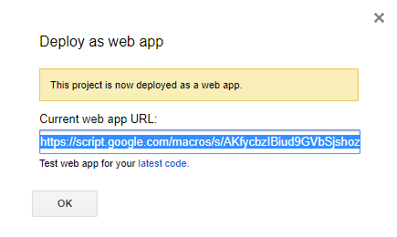

`LINE Developers` の `Messaging API 設定` にある Webhook設定の、
`Webhook URL` にペーストして更新する

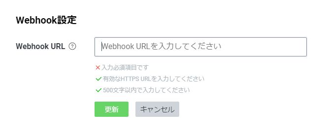

更新できたら、`Webhookの利用`という欄ができるので、これを有効にする

そして、`Messaging API 設定` にある QRコードを読み込めば、ボットを友達に追加でき、使うことができる

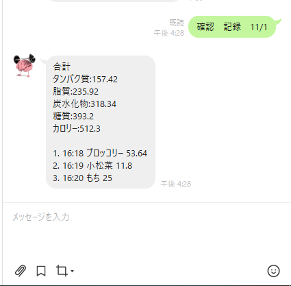